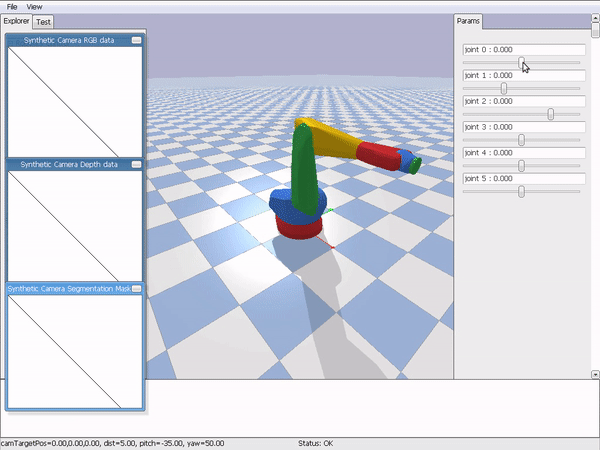

# Pybullet interactive examples

Simple interactive pybullet examples for learning how to use it.

It uses robots from https://github.com/ros-industrial/kuka_experimental.git, so you will need to
download that repo to be able to run the scripts.

